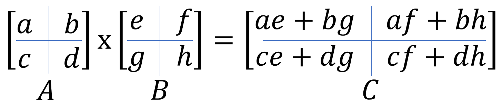
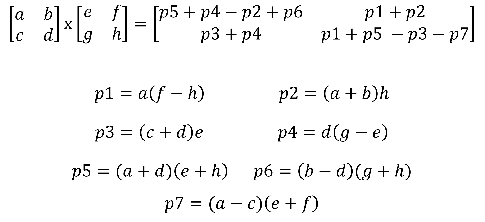

# Introduction
Hi! This is Mark Bajo and I am here to share an algorithm for fast multiplication of square matrices. Implementing fast and efficient algorithms is one of the many skills a computer scientist is expected to have. In machine learning and/or deep learning, we deal with large matrices and its computations. In modern day, we have GPU to compute large matix operations and even though implementing a naive algorithm on a GPU is still fast, there is still a need for optimizing algorithms implemented on GPU. In this article, we will focus on the core idea of optimizing square matrix multiplication.

# Contents
* Naive Algorithm
* Divide-and-conquer Algorithm
* Strassen Algorithm
* Applications
* Conclusion

# Naive Algorithm
Below is the naive implementation of matrix multiplication. Because of the three `for` loops each running a calculation `n` times, we conclude that the naive solution runs at O(n^3).
```python
def multiply(A: List[List[float]], B: List[List[float]]):
    n = len(A)
    C = [[0 for _ in range(n)] for _ in range(n)]
    for i in range(n):
        for k in range(n):
            for j in range(n):
                C[i][j] += A[i][k] * B[k][j]
    return C
```

# Divide-and-Conquer Algorithm
Now we take things to the next level. We use a divide-and-conquer aproach and try optimizing the naive algorithm. We list down the steps below.

## Matrix Multiplication Divide-and-Conquer Algorithm:
Assuming we are dealing with `A x B` and each matrix have `N by N` shape,
* We split each matrix A and B in to four submatrices, each submatrix having `N/2 by N/2` shape.
* Calculate submatrix multiplication. 
* We recurse until the submatrix shape is `1 x 1`.



Implementing this in pseudo-code,
```python
def multiply_matrix(A: List[List[float]], B: List[List[float]]) -> List[List[float]]:
    n = len(A)
    C = [[0 for _ in range(n)] for _ in range(n)]
    # Base case
    if n == 1:
        C[0][0] = A[0][0] * B[0][0]
    else:
        # Split Matrix
        a, b, c, d = split_matrix(A)
        e, f, g, h = split_matrix(B)
        
        # Colate results for submatrices
        # Recurse until 1 x 1
        C_00 = add_matrix(
            multiply_matrix(a, e), # subproblem
            multiply_matrix(b, g)
        )

        C_01 = add_matrix(
            multiply_matrix(a, f),
            multiply_matrix(b, h)
        )

        C_10 = add_matrix(
            multiply_matrix(c, e),
            multiply_matrix(d, g)
        )

        C_11 = add_matrix(
            multiply_matrix(c, f),
            multiply_matrix(d, h)
        )

        # Combine results
        C = combine_results(C_00, C_01, C_10, C_11)
    return C
```

## Time Complexity
Notice that for each part of $C$ submatrix, we are conducting multiplication and addition of matrix. For addition, the time complexity is $O(n^2)$. For the multiplication part, we will have to apply Master Theorem. This results to having this equation: $T(N) = 8T(N/2)$ which implies that the multiplication part alone has $O(n^3)$. Therefore, the whole matrix multiplication algorithm has $O(n^3)$ time complexity which is the same as the naive algorithm's time complexity. Can we do better than this? Yes! It turns out that we can reduce the number of subproblems in this recursion from 8 to 7. This is where Strassen's algorithm comes in.

# Strassen Algorithm
## Implementation
As mentioned in the previous part of this article, the [Strassen Algorithm](https://en.wikipedia.org/wiki/Strassen_algorithm) uses 7 subproblems only. The computations for the 7 subproblems are listed below.



Implementing this in pseudo-code, we get something like this:
```python
def strassen_multiplication(A: List[List[float]], B: List[List[float]]) -> List[List[float]]:
    n = len(A)
    C = [[0 for _ in range(n)] for _ in range(n)]
    # Base case
    if n == 1:
        C[0][0] = A[0][0] * B[0][0]
    else:
        # Split Matrix
        a, b, c, d = split_matrix(A)
        e, f, g, h = split_matrix(B)
        
        # Colate results for submatrices
        p1 = strassen_multiplication(
            a, 
            subtract_matrix(f, h)
        ) 
        p2 = strassen_multiplication(
            add_matrix(a, b), 
            h
        )        
        p3 = strassen_multiplication(
            add_matrix(c, d), 
            e
        )
        p4 = strassen_multiplication(
            d, 
            subtract_matrix(g, e)
        )       
        p5 = strassen_multiplication(
            add_matrix(a, d), 
            add_matrix(e, h)
        )       
        p6 = strassen_multiplication(
            subtract_matrix(b, d), 
            add_matrix(g, h)
        )        
        p7 = strassen_multiplication(
            subtract_matrix(a, c), 
            add_matrix(e, f)
        )

        # Calculate C submatrices
        C_00 = subtract_matrix(
            add_matrix(p4, p5),
            subtract_matrix(p2, p6)
        )
        C_01 = add_matrix(p1, p2)
        C_10 = add_matrix(p3, p4)
        C_11 = subtract_matrix(
            add_matrix(p1, p5),
            add_matrix(p3, p7)
        )

        # Combine results
        C = combine_results(C_00, C_01, C_10, C_11)
    return C
```

## Time Complexity
Since we have only 7 subproblems, by using Master Theorem, we have $T(N) = 7T(N/2) + O(N^2)$ which translates to time complexity $O(n^{log_2 7}) = O(n^{2.81})$. This is less than $O(n^3)$!

# Experiments
Important points that I discovered as I was experimenting with the implemented algorithm are the following.
* In multiplying small square matrices ($n<128$), I found out that the naive algorithm is the fastest. This might be because of the time it takes to fill in and calling the functions in the call stack when we do recursions. We can optimize the divide-and-conquer algorithm by changing the base case. Instead of base case being $n=1$, we can set it to $n<128$. Multiplying matrices with sizes the set value, we resort to using the naive algorithm.

```python
def strassen_multiplication(A: List[List[float]], B: List[List[float]], n_switch=128) -> List[List[float]]:
    n = len(A)
    C = [[0 for _ in range(n)] for _ in range(n)]
    # Base case
    if n <= n_switch:
        C = multiply(A, B)
    ...
```
*  

# Conclusion
In this article we have implemented Strassen Algorithm in pure python and experimented on its speed.